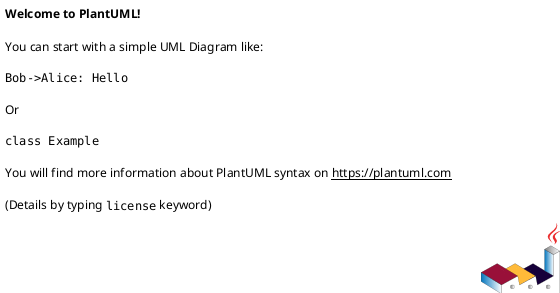

# Техническое задание для NovaSpec - Flutter/Dart версия

В папке nova-spec-ide-studio лежит проект UI написанный на TypeScript - это полностью готовый UI для разрабатываемого приложения но без бизнес-логики, его необходимо в точности как оно есть переписать на **Flutter/Dart** (но при этом не забывать соблюдать паттерны Flutter).

Полностью, без каких либо предположений изучи весь проект TypeScript

Далее описаны каждые элементы приложения на UI с его бизнес логикой:

# Онбординг

Появляется, когда пользователь впервые открывает приложение (в SharedPreferences хранилище нет никакого конфига).

Онбординг состоит шагов:

## Проект

Пользователю предлагается создать проект или открыть существующий (проектом является папка на его диске, он может либо создать новую папку если нажмет новый проект или открыть существующую папку).

### Создать новый проект

Пользователь указывает имя проекта
Путь к папке: указывает путь к папке где будет сохранен проект или нажимает кнопку Обзор после чего откроется проводник операционной системы через **file_picker**, пользователь выбирает папку и путь к этой папке записывается в поле.
В выбранной папке создается папка проект (с названием, которое указано в имени проекта)

### Открыть существующий проект

Сразу открывается проводник операционной системы через **file_picker.getDirectoryPath()**, где пользователь выбирает папку, которую откроет в приложении

### Итог

Когда пользователь создал проект или открыл папку, это сразу же должно записаться в **SharedPreferences** конфиг пользователя. Если он откроет приложение повторно, то ему этот же проект должен открыться

## Настройка ИИ и интеграции

На данном шаге пользователю предлагается перейти к настройкам ИИ или пропустить данный шаг.

### Пропустить

Онбординг закрывается

### Настроить

Открывается окно настроек (тоже самое, которое находится по пути Настройки -> Параметры)

# Окно настроек

Переход осуществляется по Настройки -> Параметры (или ctrl+,)
Откроется окно "Параметры" в нем пользователю необходимо заполнить разделы:

## Провайдер

### Выберие провайдера

В конфигурации может быть выбран только 1 провайдер
Доступные провайдеры:

#### OpenAI

Endpoint OpenAI API и пример запроса с использованием **dio**:

```dart
final dio = Dio();
final response = await dio.post(
  'https://api.openai.com/v1/chat/completions',
  options: Options(
    headers: {
      'Authorization': 'Bearer <your_api_key>',
      'Content-Type': 'application/json',
    },
  ),
  data: {
    'model': 'gpt-4o',
    'messages': [{'role': 'user', 'content': 'Hello!'}]
  },
);
```

От пользователя требуется указать только токен

#### OpenAI Competitive

OpenAI совместимое API
От пользователь требуется указать базовый URL
Пример запроса с **dio**:

```dart
final response = await dio.post(
  '<baseURL with v1>/chat/completions',
  options: Options(
    headers: {
      'Authorization': 'Bearer <your_api_key>',
      'Content-Type': 'application/json',
    },
  ),
  data: {
    'model': 'gpt-4o',
    'messages': [{'role': 'user', 'content': 'Hello!'}]
  },
);
```

также требуется токен

#### Anthropic

Пример запроса с **dio**:

```dart
final response = await dio.post(
  'https://api.anthropic.com/v1/messages',
  options: Options(
    headers: {
      'x-api-key': anthropicApiKey,
      'anthropic-version': '2023-06-01',
      'content-type': 'application/json',
    },
  ),
  data: {
    'model': 'claude-3-5-sonnet-20240620',
    'max_tokens': 256,
    'messages': [
      {'role': 'user', 'content': 'Привет, кратко опиши разницу между RAG и fine-tuning.'}
    ]
  },
);
```

Пример ответа:

```json
{
  "content": [
    {
      "citations": null,
      "text": "Hi! My name is Claude.",
      "type": "text"
    }
  ],
  "id": "msg_013Zva2CMHLNnXjNJJKqJ2EF",
  "model": "claude-sonnet-4-5-20250929",
  "role": "assistant",
  "stop_reason": "end_turn",
  "stop_sequence": null,
  "type": "message",
  "usage": {
    "input_tokens": 2095,
    "output_tokens": 503
  }
}
```

требуется токен

##### Пример запроса моделей

Запрос с **dio**:

```dart
final response = await dio.get(
  'https://api.anthropic.com/v1/models',
  options: Options(
    headers: {
      'x-api-key': anthropicApiKey,
      'anthropic-version': '2023-06-01',
    },
  ),
);
```


#### Cerebras

Официальный SDK, адаптировать для Dart с использованием **dio**:

```dart
final dio = Dio();
final response = await dio.post(
  'https://api.cerebras.ai/openai/v1/chat/completions',
  options: Options(
    headers: {
      'Authorization': 'Bearer $cerebrasApiKey',
      'Content-Type': 'application/json',
    },
  ),
  data: {
    'model': 'llama-4-scout-17b-16e-instruct',
    'messages': [
      {'role': 'user', 'content': 'Why is fast inference important?'}
    ]
  },
);
```

требуется токен

##### Пример запроса моделей

```dart
final response = await dio.get(
  'https://api.cerebras.ai/openai/v1/models',
  options: Options(
    headers: {'Authorization': 'Bearer $cerebrasApiKey'},
  ),
);
```


#### Groq

Пример запроса с **dio**:

```dart
final response = await dio.post(
  'https://api.groq.com/openai/v1/chat/completions',
  options: Options(
    headers: {
      'Authorization': 'Bearer $groqApiKey',
      'Content-Type': 'application/json',
    },
  ),
  data: {
    'model': 'openai/gpt-oss-20b',
    'messages': [
      {'role': 'user', 'content': 'Explain the importance of low latency LLMs'}
    ]
  },
);
```

Требуется запросить токен

#### LM Studio и Ollama

Полностью идентичны
API соответствует OpenAI Competitive
Требуется запросить Базовый URL
Токен опционально

#### OpenRouter

Пример запроса с **dio**:

```dart
final response = await dio.post(
  'https://openrouter.ai/api/v1/chat/completions',
  options: Options(
    headers: {
      'Authorization': 'Bearer $openrouterApiKey',
      'Content-Type': 'application/json',
    },
  ),
  data: {
    'model': 'openai/gpt-4o-mini',
    'messages': [
      {'role': 'user', 'content': 'Сравни RAG и fine-tuning в 3 пунктах'}
    ],
    'temperature': 0.3,
    'max_tokens': 300,
  },
);
```


#### Общие требования

Заголовки: OpenAI/Groq/OpenRouter/Cerebras/LM Studio/Ollama — Authorization: Bearer; Anthropic — x-api-key и обязательный anthropic-version;

### Интеграция с Confluence

По умолчанию настройка отключена
Если ее включить появляются поля

#### Базовый URL

Пользователь указывает URL на Confluence, к которому хочет подключиться
Необходимо учесть определение типа инстанса по URL который указал пользователь:

```dart
String getConfluenceBaseUrl(String userUrl) {
  final uri = Uri.parse(userUrl);
  
  if (uri.host.endsWith('atlassian.net') && uri.path.contains('/wiki')) {
    // Confluence Cloud
    return 'https://${uri.host}/wiki/rest/api';
  } else {
    // Data Center/Server
    return '${uri.scheme}://${uri.host}${uri.path}/rest/api';
  }
}
```


#### Email

Электронная почта пользователя для Confluence

#### Токен

Токен пользователя для Confluence

## Музикация

Указывается токен и выбирается жанр

### Жанр

Важное уточнение, на UI опции жанра должна быть указаны на языке выбранной локализации через **flutter_localizations**
В конфиг записывается системное наименование жанра, вот параметры:

```dart
// Русская локализация
final Map<String, String> genresRu = {
  'Поп': 'pop',
  'Русский рэп': 'russian rap',
  'Рок': 'rock',
  'Джаз': 'jazz',
  'Классика': 'classic',
  'Электронная музыка': 'electric music',
  'Хип-хоп': 'hip-hop',
  'R&B': 'r&b',
};

// Английская локализация
final Map<String, String> genresEn = {
  'Pop': 'pop',
  'Russian rap': 'russian rap',
  'Rock': 'rock',
  'Jazz': 'jazz',
  'Classic': 'classic',
  'Electro music': 'electro music',
  'Hip-hop': 'hip-hop',
  'R&B': 'r&b',
};
```


## Язык

Выбирается язык UI, по умолчанию используется русский (во Flutter потребуется делать локализацию на двух языках через **flutter_localizations**)

## Кнопка "Проверить"

По данной кнопке выполняется вызов каждого сервиса, по которым пользователь задал настройки.
Например по провайдерам - вызывается API выбранного провайдера на запрос моделей через **dio**
По Интеграции с Confluence вызывается API для получения списка пространств через **dio**
По Музикации вызывается gen-api.ru по следующему примеру:

```dart
final response = await dio.get(
  'https://api.gen-api.ru/api/v1/user',
  options: Options(
    headers: {
      'Authorization': 'Bearer $token',
      'User-Agent': 'NovaSpec/1.0',
    },
  ),
);
```

Пример ответа:

```json
{
  "name": "Kotey Ye",
  "email": "koteyye@gmail.com",
  "phone_number": null,
  "balance": 33,
  "email_verified_at": "2025-09-21T12:19:51.000000Z",
  "created_at": "2025-09-21T12:19:51.000000Z"
}
```

Кстати, этот же метод возвращает текущий баланс (поле balance в ответе), который дальше понадобится для индикатора

### По всем вызовам вернулся 200 (успешно)

Показывается **SnackBar** уведомление, что все интеграции успешно прошли проверку

### Хотя по одному из вызовов вернулось не 200 (не успешно)

Показывается **SnackBar** уведомление, что <название интеграции - провайдер, confluence или музикация> не прошел проверку: <подробная ошибка от сервиса, почему не прошла ошибка>

## Кнопка "Сохранить"

Сохраняет все настройки в **SharedPreferences**
По умолчанию недоступна, сохранить можно только после выполнения проверки интеграции (кнопка "Проверить").
Если проверка пройдена успешно, то кнопка "Сохранить" доступна
Если проверка не пройдена, то кнопка "Сохранить" задизейблена
Если пользователь вышел из окна параметров не сохранив, то изменения не сохраняются в **SharedPreferences**

# О программе

Открывается отдельный **Dialog** со статичным текстом:

```
NovaSpec
Профессиональный инструмент для совместной выработки технических заданий с ИИ-ассистентом. Превращает идеи в структурированную документацию.
```


## Версия

Указывается текущая версия из pubspec.yaml через **package_info_plus**

## Создатель

Статично указывается Koteyye (можно тоже подтягивать из pubspec.yaml)

# Главный экран

В верхнем меню содержится ряд меню через **MenuBar** и **MenuAnchor**:

## Файл

### Новый проект (CTRL+N)

Открывается окно как было в онбординге, где нужно указать название проекта и выбрать папку проекта через **file_picker**

### Открыть проект

Открывается проводник операционной системы через **file_picker.getDirectoryPath()**, в котором нужно выбрать папку для открытия, выбранная папка откроется в рабочем пространстве

### Сохранить

Сохраняет текущее состояние открытого в рабочей области файла (конкретно открытую вкладку) через **dart:io File.writeAsString**

### Сохранить как...

Открывается проводник операционной системы через **file_picker.saveFile()**, в которой нужно выбрать папку куда сохранить и указать название файла, с которым он будет сохранен

## Настройки

### Параметры

Открывает параметры (которые были описаны ранее, где настраивается провайдер и интеграции)

### Шаблоны

Открывает отдельное окно для настройки шаблонов (логика описана далее)

## О программе

Открывает отдельный **Dialog** (который был описан ранее, где статичный текст, версия и создатель)

***

Справа в верхнем меню содержатся индикаторы:

## AI + настроенный провайдер

Если AI не включен, то индикатор отображается как неактивный, а провайдер не пишется

## Интеграция с Confluence

Активна/не активна

## Музикация

Активна/не активна
Если активна, то показывается баланс gen-api в таком формате: 1250 ₽ и иконка для обновления
(баланс возвращается в ответе https://api.gen-api.ru/api/v1/user, описанный ранее)
По иконке обновить, повторно вызывается метод https://api.gen-api.ru/api/v1/user через **dio** и записывается актуальный баланс

# Проводник

Статично указан логотип и название приложения NovaSpec (svg файл логотипа загружается через **flutter_svg**, файлы novaspec-logo.svg, atlassian-icon.svg - это логотип atlassian для индикатора интеграции с Confluence)
Далее идет открытая папка проекта
В папке представлены файлы для отображения через **Directory.listSync()**
Для поддерживаемых файлов есть свои иконки (есть в ts проекте, их надо переиспользовать во Flutter через **flutter_svg**)
Поддерживаемые форматы:
.md .html .json .mp3 .xml .txt
Все остальные форматы отображаются в виде дефолтной иконки
У каждого файла указано название файла и расширение

Кликнув по файлу в проводнике он откроется в рабочей зоне на отдельной вкладке через **TabBar**
Если вкладка с файлом уже есть, то открывается вкладка

# Рабочая зона

В зависимости от открываемого формата файла, он по разному открывается в рабочей зоне:

## .md и .html

Открывается в режиме рендера через **flutter_markdown** или **flutter_html**
При необходимости можно переключить в режим редактирования, тогда файл открывается в режиме редактирования кода используя кастомный редактор на базе **webview_flutter** с Monaco Editor
Еще у открытого .md и .html, если включена "Музикация", то должна быть доступна кнопка-иконка музицировать.

### Музицировать

При нажатии на кнопку открывается **Dialog** "Музицировать документ"
Если нажать нет, то окно закрывается и ничего не происходит
Если нажать Да, то выполняется ряд действий, на каждое выполняемое действие снизу подсвечивается состояние:

#### Генерирую Lyrics

Выполняется запрос в текущую модель (та же модель, что выбрана для AI-ассистент) из конфига через **dio**.
Промт для модели:

```
Составь текст песни, чтобы зачитать данные требования в жанре {текущий жанр в конфиге}.
Текст должен быть сделан в виде Lyrics пригодным для Suno
В ответе не указывай ничего лишнего, исключительно Lyrics
Требования: {требования из открытого файла, который пользователь хочет музицировать}
```


#### Генерирую музыку в Suno

Выполняется запрос на генерацию песни в Suno через gen-api.ru с использованием **dio**:

```dart
final response = await dio.post(
  'https://api.gen-api.ru/api/v1/networks/suno',
  options: Options(
    headers: {
      'Authorization': 'Bearer $token',
      'Content-Type': 'application/json',
    },
  ),
  data: {
    'title': 'Свобода',
    'tags': genreFromConfig,
    'prompt': lyricsFromAI,
    'translate_input': false,
    'model': 'v5',
  },
);
```

Далее анализируем коды ответа:

##### 200 или 201

Запрос принят, получаем такое тело ответа:

```json
{
  "request_id": 28104643,
  "model": "suno",
  "status": "processing"
}
```

По данному телу ответа сохраняем временно request_id, он потребуется для отслеживания результата генерации

##### 402

Недостаточно средств на балансе gen-api

##### Остальные коды ошибок:

400	Запрос с таким request_id не найден
401	В запросе нет токена авторизации или токен неверный
404	Указана несуществующая нейросеть
503	Непредвиденная ошибка, обратитесь в службу поддержки
419	Слишком много запросов

***
Далее, когда у нас есть request_id, в рамках текущего состояния каждые 2 секунды через **Timer.periodic** вызывается метод:

```dart
final response = await dio.get(
  'https://api.gen-api.ru/api/v1/request/get/$requestId',
  options: Options(
    headers: {'Authorization': 'Bearer $token'},
  ),
);
```

Следим за значением "status"
Завершаем опрашивание когда получаем ответ со статусом success:

```json
{
  "id": 28104643,
  "status": "success",
  "response_type": "audio",
  "cost": 17,
  "progress": 100,
  "result": [
    "https://gen-api.storage.yandexcloud.net/input_files/1760102881_68e909e1ae303.mp3",
    "https://gen-api.storage.yandexcloud.net/input_files/1760102886_68e909e650cf9.mp3"
  ]
}
```


#### Сохраняю трек

В теле ответа, в массиве result, указаны ссылки на скачивание сгенерированных файлов (генерируется всегда 2)
Нужно скачать каждый файл через **dio.download()** и сохранить его в папку проекта
Сразу после этого должно произойти обновление проводника через **setState**, чтобы пользователь увидел в нем созданные файлы

#### Музикация выполнена

Состояние показывается 3 секунды через **Future.delayed**, потом исчезает

#### Graceful shutdown музикации

Когда пользователь закрывает приложение во время выполнения музикации, пользователю показывается **AlertDialog**, в котором у пользователя спрашивают уверен ли он что хочет закрыть программу, т.к. музикация еще не завершена. Пользователь может подтвердить и программа закроется или отменить, тогда программа не закрывается.
Если пользователь подтверждает, то программа остается работать в фоне и процесс музикации продолжает выполняться, пока не завершится.
Программа всегда после подтверждения пользователя о закрытии сохраняет лог выполняемой музикации в файл, в котором содержится request_id.
Когда программа повторно запускается, выполняется сканирование на наличие лога музикации, если лог есть, то программа пытается продолжить процесс музикации с этим request_id.
Если файл музикации удалось скачать, то лог удаляется
Если сервис музикации (по API) ответил, что файл уже удален, то лог тоже удаляется, но без файла музикации

## .mp3 и .wav

Открывается в режиме минималистичного аудиоплеера с использованием **audioplayers**:

```dart
class MinimalAudioPlayer extends StatefulWidget {
  final String audioPath;
  
  @override
  _MinimalAudioPlayerState createState() => _MinimalAudioPlayerState();
}

class _MinimalAudioPlayerState extends State<MinimalAudioPlayer> {
  final AudioPlayer _audioPlayer = AudioPlayer();
  bool _isPlaying = false;
  Duration _duration = Duration.zero;
  Duration _position = Duration.zero;

  @override
  void initState() {
    super.initState();
    _audioPlayer.setSourceDeviceFile(widget.audioPath);
    _audioPlayer.onDurationChanged.listen((duration) {
      setState(() => _duration = duration);
    });
    _audioPlayer.onPositionChanged.listen((position) {
      setState(() => _position = position);
    });
  }
}
```

Дизайн кнопок по стилю и формам должен быть в едином стиле с основным UI

## YAML JSON

Проверяется синтаксис файла yaml через **yaml** пакет или json через **dart:convert**, если он соответствует синтаксису OpenAPI, то на рабочей области данный файл отображается как Swagger UI
Для отрисовки Swagger UI используется **webview_flutter**

### webview_flutter для Swagger UI

Архитектура:
В приложении запускается фоновый HTTP-сервер через **shelf** с хендлером SwaggerUI, который рендерит выбранную OpenAPI спецификацию из файла.

**WebViewWidget** открывает локальный URL (например, http://127.0.0.1:4001), показывая интерактивную документацию Swagger UI.

Зависимости:

```yaml
dependencies:
  shelf: ^1.4.1
  shelf_static: ^1.1.2
  webview_flutter: ^4.4.2
```

Сервис фона (HTTP-сервер):

```dart
import 'package:shelf/shelf.dart' as shelf;
import 'package:shelf/shelf_io.dart' as shelf_io;

class SwaggerService {
  HttpServer? _server;
  
  Future<void> start(String specPath) async {
    final handler = _createHandler(specPath);
    _server = await shelf_io.serve(handler, '127.0.0.1', 4001);
  }
  
  Future<void> restart(String newSpecPath) async {
    await stop();
    await start(newSpecPath);
  }
  
  Future<void> stop() async {
    await _server?.close();
  }
}
```


## Все остальные форматы

Открываются в режиме редактора кода, использовать кастомный редактор на базе **webview_flutter** с Monaco Editor
Такие файлы можно редактировать и сохранять изменения через **File.writeAsString**

# AI-ассистент

В данном разделе представлен интерфейс взаимодействия с AI
Он может скрываться вправо
У него есть режимы:

## Диалог

В данном режиме происходит чистое общение с ИИ и при необходимости редактирование файлов, если пользователь попросит.
У ИИ должны быть инструменты для редактирования файлов проекта.
Например, если пользователь просит: Добавь в requirements.md следующее...
В ИИ уходит контент файла, который пользователь указал, потом ИИ предлагает внести в него изменения, затем пользователь его аппрувит или отклоняет.
При внесении изменений в рабочей области показываются изменения через **diff_match_patch** (красным что удаляется, желтым что изменяется)
Если пользователь отклоняет предложение ИИ, то далее в формате диалога он может делать новый запрос в рамках того же диалога

## Создать ТЗ по шаблону

В данном режиме выполняется запрос в ИИ вместе с шаблоном (который выбран)
ИИ предлагает создать новый файл с ТЗ с содержанием (выполнением задачи от пользователя)
Пользователь может аппрувнуть или отклонить новое ТЗ и продолжить работать над ним в рамках диалога с ИИ

## Новый чат

По кнопке в чате стирается весь контекст и начинается все с чистого листа

## История чатов

Показываются все сессии которые были у пользователя с ИИ через **SharedPreferences** или **hive**
Пользователь может открыть любую сессию и продолжить диалог

## Раздел с полем для ввода сообщения:

### model: <имя модели>

**GestureDetector** поле, при клике на него открывается список доступных моделей.
Кликнув по полю делается запрос в AI провайдера для получения доступных моделей через **dio**
В списке показывается максимум 10 опций через **ListView.builder**, если провайдер вернул больше, то появляется скрол
Выбранная пользователем модель перезаписывается в **SharedPreferences**

### Регенерировать

**IconButton** - который повторно отправляет ранее отправленное пользователем сообщение в ИИ

### Поле для ввода сообщения

**TextField** для указания промта от пользователя
Пользователь может указать символ @ и начать вводить название файла или каталога, в этом случае открывается список файлов/каталогов. В этот список попадают файлы проекта, которые по имени совпадают с тем, что вводит пользователь
Например, есть файлы:
requirement1.md
requirement2.md
requirement3.md
spec.mp
Когда пользователь введет @r то откроется список с 3 доступными опциями:
requirement1.md
requirement2.md
requirement3.md
и так далее
Когда пользователь выбрал из списка файл, он полностью записывается в поле и имеет по шрифту визуальное отличие от остального текста, например: Прочитай **@requirement1.md** и составь по нему требования.

Далее по **IconButton** отправить или при нажатии на клавишу Enter отправляется запрос в модель из конфига

#### Промт для модели

##### Выбран режим Создание ТЗ по шаблону

Ты AI-ассистент в программе NovaSpec.
Ты профессиональный системный/бизнес аналитик. Умеешь грамотно составлять аналитические артефакты (технические задания, спецификаций, функциональной документации, openAPI и т.п.)
Пользователь через программу написал тебе сообщение: \${текст сообщения от пользователя}
Контент файлов, которые указал пользователь: \${файлы из контекста}
По сообщению пользователя необходимо составь аналитический артефакт \${тип шаблона} по шаблону: \${шаблон из конфига}
Ответ должен быть в формате \${см. требования к взаимодействию с ИИ}

##### Выбран режим Диалог

Ты AI-ассистент в программе NovaSpec.
Ты профессиональный системный/бизнес аналитик. Умеешь грамотно составлять аналитические артефакты (технические задания, спецификаций, функциональной документации, openAPI и т.п.)
Пользователь через программу написал тебе сообщение: \${текст сообщения от пользователя}
Контент файлов, которые указал пользователь: \${файлы из контекста}
У пользователь в рабочей области приложения открыт файл: \${контент файла, открытого у пользователя в рабочей области}
Ответ должен быть в формате \${см. требования к взаимодействию с ИИ}

##### В любом режиме

В любом режиме ИИ должен иметь возможность прочитать любой файл в открытом проекте пользователя, например там может быть открыт целый репозиторий с каким-нибудь приложением, и ИИ может захотеть его прочитать в рамках задачи, необходимо оптимизировать промт, чтобы ИИ мог это делать


#### Требования к взаимодействию с ИИ

## SSE-интерфейс для взаимодействия с ИИ-агентом

### 1. Описание задачи

Реализовать канал односторонней потоковой передачи событий от ИИ-бэкенда к клиентскому приложению на основе Server-Sent Events (SSE) через **eventsource** пакет для отображения текстовых ответов, предложений по редактированию файлов, статусов генерации и ошибок.

### 2. Протокол обмена

#### 2.1. Транспорт

- Использовать HTTP/1.1 или HTTP/2 (желательно) с заголовком
`Content-Type: text/event-stream`.
- Ответ сервера должен быть «долгоиграющим» (keep-alive), без закрытия соединения после первого ответа.
- Запретить кэширование: `Cache-Control: no-cache, no-transform`.


#### 2.2. Формат событий во Flutter

```dart
import 'package:eventsource/eventsource.dart';

class AIService {
  Stream<AIEvent> connectToAI(String conversationId) async* {
    final eventSource = await EventSource.connect(
      Uri.parse('$baseUrl/api/stream/$conversationId'),
      headers: {'Authorization': 'Bearer $token'},
    );

    await for (final event in eventSource) {
      if (event.data != null) {
        final data = jsonDecode(event.data!);
        yield AIEvent.fromJson(data);
      }
    }
  }
}

class AIEvent {
  final String type; // message|file_edit|status|error
  final String id;
  final String conversationId;
  final int timestamp;
  final AIEventData data;

  const AIEvent({
    required this.type,
    required this.id,
    required this.conversationId,
    required this.timestamp,
    required this.data,
  });

  factory AIEvent.fromJson(Map<String, dynamic> json) {
    return AIEvent(
      type: json['type'],
      id: json['id'],
      conversationId: json['conversation_id'],
      timestamp: json['timestamp'],
      data: AIEventData.fromJson(json['data']),
    );
  }
}

class AIEventData {
  final String? text;
  final String? filePath;
  final String? diff;
  final String? status;
  final String? errorMessage;

  const AIEventData({
    this.text,
    this.filePath,
    this.diff,
    this.status,
    this.errorMessage,
  });

  factory AIEventData.fromJson(Map<String, dynamic> json) {
    return AIEventData(
      text: json['text'],
      filePath: json['file_path'],
      diff: json['diff'],
      status: json['status'],
      errorMessage: json['error_message'],
    );
  }
}
```


### Если включена интеграция с Confluence

При включенной интеграции с Confluence пользователь может прикладывать в сообщения для AI ссылки на Confluence (программа должна распознавать эти ссылки по baseURL, который лежит у нее в **SharedPreferences**).
Если ссылка прикреплена, то программа пытается вызвать подключенную API Confluence для получения контента страницы, на которую сослался пользователь через **dio**. Если ссылка на Confluence ведет не на страницу, то она просто игнорируется.
В чате с AI ссылки на страницы, по которым включен контент в запрос должны подсвечиваться зеленым через **RichText** и **TextSpan**

***

# Шаблоны

Это окно открывается из Настройки -> Шаблоны
В данном окне задается настройки шаблона в частности:

## Тип шаблона

**DropdownButton** с доступными типами шаблонов. По умолчанию существуют типы Техническое задание и Функциональная документация

### Создание типа

При нажатии на плюс, открывается **Dialog** "Добавить тип шаблона" с **TextField** полями Название типа шаблона и имени типа
**TextButton** отменить - закрывает окно
**ElevatedButton** сохранить - сохраняет тип в **SharedPreferences**

### Редактирование типа

При нажатии на карандаш открывается **Dialog** "Редактировать тип шаблона", он точно такой же как создание типа, только все поля предзаполнены и их можно изменить

### Удаление типа

Удаляет выбранный в **DropdownButton** тип. Типы, которые зашиты в приложение по умолчанию нельзя удалить

## Шаблон

**DropdownButton** с доступными шаблонами (список фильтруется по выбранному типу шаблона). По умолчанию существующие шаблоны:
Для типа Техническое задание: User Story One Page, контент шаблона сохраняется в **SharedPreferences** как большая строка markdown.


```md
## Шаблон и правила описания

### 1. User Story

Обязательный раздел.

В рамках одной страницы может быть описана только одна US!

Заполняется по формуле: **Я, как..., хочу..., чтобы...**

Например, Я, как Администратор, хочу удалять обучения из специализации, чтобы студенты изучали только актуальные для них обучения и не тратили свое время на ненужный контент.

**Правила заполнения:**

| Элемент | Пример |
|---------|--------|
| **Как** | Указывается Роль процесса или обощенное наименование наименование Группы пользователей, Конкретная должность, Сотрудник определенного подразделения | Как Административный руководитель сотрудника<br>Как Сотрудник подразделения C&B<br>Как пользователь с ролью "Инициатор" |
| **Хочу** | Указывается целевое действие пользователя без лишней детализации | Хочу создавать заявку на получение справки<br>Хочу вносить изменения в существующий документ<br>Хочу получать уведомления когда получено решение по моему обращению |
| **Чтобы** | Указывается ценность указанного "хочу" для пользователя, раскрывается его мотивация совершать действие. | Чтобы своевременно отреагировать на задачу.<br>Чтобы одновременно оформить несколько кадровых перемещений.<br>Чтобы согласовать запуск процедуры с другими участниками процесса. |

Не нужно формировать роль в User Story как система. Это должен быть какой-либо пользователь.

В качестве альтернативы, допускается использовать формат Job Story. Тогда данный раздел необходимо переименовать в "Job Story" и заполнять по формуле **Когда..., хочу...,чтобы...**

**Определение формата истории**
User Story используется, когда задача связана с конкретным пользователем или группой пользователей, которые взаимодействуют с системой. Формат: Я, как [роль пользователя], хочу [действие], чтобы [ценность].

Пример: Я, как администратор, хочу удалять обучения из специализации, чтобы студенты изучали только актуальные для них обучения.
Job Story используется, когда задача не связана с конкретным пользователем, а описывает системное поведение или интеграцию. Формат: Когда [событие], хочу [действие], чтобы [результат].

Пример: Когда внешняя система интегрируется с Docs, она должна иметь возможность получать информацию о подписанных документах, чтобы использовать эту информацию для валидации в бизнес-процессах.
Рекомендации по выбору формата
Если в задаче фигурирует конкретный пользователь или роль, используйте User Story.
Если задача описывает системное поведение без конкретного пользователя, используйте Job Story.
В случае сомнений, оцените, что является ключевым элементом задачи: пользователь или системное событие.


### 2. Контроль версионности

Обязательный раздел.

Раздел для ведения истории изменений.

Предназначен для фиксации ключевых изменений функциональности, а это значит что фиксировать каждое мелкое изменение документации нецелесообразно (для этого есть функции "История Страницы" и "Сравнение выбранных версий").

Критерий для фиксации версии - внесенные изменения повлияют на работу других членов команды или порождают необходимость сделать новую постановку задачи на разработку Также, если по итогам разработки необходимо зафиксировать фактическую реализацию.

**Рекомендованный формат для фиксирования версионности:**

| № версии | Ссылка на Jira | Описание изменений | Предыдущая версия статьи | Лист согласования |
|----------|----------------|-------------------|--------------------------|-------------------|
| Рекомендуется начинать с версии 1.0 - это должна быть версия, которая согласована с бизнесом/PO.<br>Далее, отображать изменения по мере обогащения функционала и внесения уточнений. | Размещается ссылка на US в Jira при помощи макроса "Вставить фильтр/проблема в Jira".<br>Если по итогам изменений заводить и планировать в спринт новую US в Jira не требуется, то ссылка не указывается. | Указывается что изменилось относительно предыдущей версии.<br>Для первой версии можно проставить "-", для последующих - описать изменения только относительно предыдущей версии. | Указывается версия страницы Confluence, с которой необходимо сравнивать новую версию. Для поиска старой версии необходимо использовать функцию История страницы.<br>Для первой версии проставить "-", для последующих - дать ссылку на старую версию страницы, с которой можно сравнить правки при помощи функции "Сравнение выбранных версий". | Указать согласующих при помощи элемента "Список задач". Далее, по мере получения согласований отмечать их в чек-боксах. |
| 1.0 | ELEMENT-895 - Сервис отпусков_Виджет ЗАКРЫТ | - | v.8 | PO - Иванов Иван<br>Заказчик - Иванов Иван<br>TL - Иванов Иван |
| 1.1. | - | В версии 1.0 реализовали иначе, чем описано. Внесены правки чтобы документ соответствовал фактической реализации. | - | - |
| 1.2. | ELEMENT-1750 - Рефакторинг_Виджет ЗАКРЫТ | Добавили новую функцию просмотра истории сообщений | v.10 | PO - Иванов Иван<br>Заказчик - Иванов Иван<br>TL - Иванов Иван |

### 3. Проблематика

Обязательный раздел.

Описывается бизнес-проблема или ситуация, из которой была выделена US. Блок должен более широко раскрывать контекст US, например, в случаях:
* получена обратная связь от пользователей
* необходимо учесть новые особенности бизнес-процессов
* обнаружены ошибки предыдущих реализаций

### 4. Критерии приемки

**Обязательный раздел.**

Критерии приемки — это ключевые условия, которые должны быть выполнены, чтобы считать User Story реализованной. Они служат основой для создания тест-кейсов и определяют, когда работа считается завершенной.

**Основные принципы формулирования критериев приемки:**

1. **Фокус на бизнес-ценности:**
   - Описывайте, какую пользу получит бизнес или пользователь
   - Формулируйте с точки зрения результата для пользователя, а не технической реализации
   - Пример: ✅ "Пользователь может найти нужный документ по его названию или дате создания"

2. **Ориентация на конечный результат:**
   - Избегайте технических деталей реализации
   - Описывайте, что должно быть достигнуто, а не как это должно быть сделано
   - Пример: ✅ "Система уведомляет пользователя о необходимости подписать документ"
   - Пример: ❌ "Система отправляет push-уведомление через Firebase Cloud Messaging"

3. **Измеримость:**
   - Критерии должны быть конкретными и проверяемыми
   - Должна быть возможность однозначно определить, выполнен критерий или нет
   - Пример: ✅ "Пользователь может отфильтровать документы по статусу подписания"

**Что НЕ должно быть в критериях приемки:**
- Технические детали реализации (они относятся к функциональным требованиям)
- Нефункциональные требования, такие как время отклика или производительность (для них есть отдельный раздел)
- Подробные описания UI/UX (они относятся к функциональным требованиям)

**Примеры хороших критериев приемки:**
- "Пользователь может видеть список всех своих документов, ожидающих подписания"
- "Внешние системы могут проверить, подписал ли пользователь определенный документ"
- "Администратор может добавлять новые шаблоны документов в систему"
- "Пользователь получает уведомление при появлении нового документа на подпись"

**Примеры плохих критериев приемки:**
- ❌ "Разработан REST API метод GET /api/documents" (техническая деталь)
- ❌ "Время ответа API не превышает 500 мс" (нефункциональное требование)
- ❌ "Кнопка 'Подписать' окрашена в зеленый цвет" (деталь UI)

### 5. Сценарии использования

Условно обязательный.

Описываются в случае, если подразумевается взаимодействие пользователя с интерфейсом. Раздел должен включать в себя набор сценариев, необходимых для реализации US и покрывать Критерии приемки.
Если UI не используется, то сценарии не заполняются

**Общие рекомендации к описанию сценариев:**
1. Встретиться и обсудить с дизайнером предполагаемые сценарии.
2. Не использовать в сценариях готовые дизайн-решения, а описывать исходя из смысла действия – что происходит и результат действия. Стоп-слова: "нажимает на кнопку "сохранить"; открывается модалка; заполняет таблицу; заполняет поле ввода (инпут); видит поля ввода A, B, C" и т.д.
3. Указывать атрибуты необходимые для выполнения сценария
4. Давать ссылки, если упоминаются другие части документации (методы, подробные описания логики, проверки, модели и т.д.)
5. Описывать обратную связь пользователю об успехе или неуспехе сценария
6. После составления и утверждения макетов, Сценарии использования необходимо привести в соответствие и обогатить дополнительной информацией (упоминание методов, таблиц и пр.). Расхождения сценариев с макетами при поступлении задачи в разработку быть не должно.

| № | Требования к заполнению | Пример |
|---|------------------------|--------|
| 1 | Наименование кейса<br>Входящее условие: какие условия должны выполняться, чтобы начать выполнение кейса<br>Успешный сценарий: Описание Use Case в формате взаимодействия пользователя с системой. Если реакция системы предполагает вызов метода или обращение к таблице, необходимо указать это и дать ссылку на страницу или место в документации, где метод/таблица описаны подробно<br>Альтернативные/негативные сценарии: Описываются шаги, которые предполагают:<br>• Некорректные действия пользователя и реакцию системы на них<br>• Некорректные действия системы и оповещение пользователя о них<br>Примечание: если альтернативный кейс получается объемным, его можно выделить как отдельный. | Администратор хочет добавить новый тэг для новостей<br>Входящее условие: пользователь обладает ролью "Администратор" и вызвал меню "Редактировать" в разделе "Справочник тэгов".<br>Основной сценарий:<br>1. Пользователь инициирует добавление тэга<br>2. Система предлагает заполнить наименование тэга, дату его ввода и признак активности<br>3. Пользователь вводит атрибуты и пробует сохранить результат<br>4. Система проверяет тэг на дубли и правила заполнения (ссылка на описание проверок)<br>5. Если все ок, система вызывает метод /postTag (ссылка на описание метода) и записывает тэг в таблицу dbNews.tags, после чего оповещает пользователя об успехе.<br>6. Пользователь видит что новый тэг добавлен в перечень.<br><br>Альтернативный сценарий:<br>4. Система проверяет тэг на дубли и правила заполнения (ссылка на описание проверок)<br>   4.1. Если проверка не пройдена, пользователь получает сообщение с указанием какие критерии проверки были нарушены.<br>   4.2. Осуществляется возврат на п. 3 Основного сценария. |

Допускается использовать более полные, "классические", шаблоны описания Use Case. Важно, чтобы содержательная часть при этом соответствовала вышеуказанным требованиям и не перегружала описание сценария.

**Опционально:**
* Описание / модель процесса, осуществляемого в рамках US или Use Case диаграмма.
* Sequence-диаграмма для описания последовательности взаимодействия компонентов будущего решения

### 6. Функциональные требования

Обязательный раздел.

В данном блоке подробно описываются все требования, которые были выявлены по задаче. В обязательном порядке, если применимо к конкретной задаче, должны быть описаны требования к данным, пользовательским и интеграционным интерфейсам.

Далее приводится пример компоновки и содержания требований. Можно использовать как приведенный ниже формат, так и использовать свой - важно, чтобы в конечном итоге документ содержал требования к Front, Back, UI\UX (если таковые дорабатываются в рамках задачи).

Если решили использовать вкладки, то можно добавлять свои по мере надобности (например, необходимо описать требования к двум разных BackEnd'ам, можно разбить требования к каждому из них на разные вкладки)

Рекомендуется группировать требования по основным блокам, чтобы команде было удобнее ориентироваться в требованиях. Например:

#### Front

В данный раздел размещаются требования к Front End. Содержание вкладки может быть следующим:

| Swagger | Размещается ссылка ссылка на GitLab или иной источник, если контракт внешний. |
|---------|-----------------------------------------------------------------------------|
| Макеты | Размещается ссылка на Figma |

Примеры того что можно описать тут:
- Требования к заполнению полей на интерфейсе (обязательность, проверки корректности ввода, маски)
- Взаимодействие пользователя с элементами интерфейса (как ранее не описанных, так и расширение описания элементов, упомянутых в пользовательских сценариях)
- Отсылки к используемым интеграционным методам (как правило, BFF)
- Добавление тултипов и источники текста для них (хардкод, настройкой в админке и т.д.)
- Маппинг цветов и значений для статусной модели
- Что будет проиходить при переходе из одного режима в другой (например, из чтения в редактирование)
- Условия активности кнопок и их покраски в определенные цвета
- Проверки, выполняемые на стороне Front End
- Используемые значения по умолчанию (например, отображать текущий год в календаре)
- Возможность сортировать данные и логика работы сортировки, значения по умолчанию
- Возможность фильтрации, значения по умолчанию
- Как отрабатываются ошибки (как пользовательские, так и технические) на Front End. Как эти ошибки визуализируются (сообщением, цветом и т.д.)
- Разметка событий для последующей аналитики (например, фиксация клика пользователя по определенной кнопке, чтобы посчитать частоту использования сервиса)
- И прочее

#### Back

В данный раздел размещаются требования к Back End. Содержание вкладки может быть следующим:

| Swagger | Размещается ссылка ссылка на GitLab или иной источник, если контракт внешний. |
|---------|-----------------------------------------------------------------------------|

Примеры того что можно описать тут:
- Требования к данным (с типами и примерами значений)
- Структура БД (табличное описание, ER-диаграмма)
- Необходимые вычисления и проверки, логика присвоения значений полям и переменным
- Требования к интеграционным методам (BFF, Back2Back)
- Требования к хранению и архивированию данных, документов
- Возможные ошибки и способы их обработки
- Маппинги полей
- Разметка событий для последующей аналитики (например, количество фактов прихода некорректных данных из внешней системы)
- При описании API необходимо указывать протоколы и технологию, которая будет применяться для реализации (REST, gRPC, Kafka и т.п.)
- И прочее

#### UX\UI

В данный раздел размещаются требования к учету определенного пользовательского поведения, опыту и интерфейсным особенностям.

Как правило, данные требования необходимо зафиксировать до появления требований к Front End, чтобы дизайнер смог отрисовать макеты. Далее, уже при помощи макетов описываются требования к Front End.

Содержание вкладки может быть следующим:

| Макеты | Размещается ссылка на Figma |
|--------|------------------------------|

- Бизнесовые требования к интерфейсу
- Выявленные особенности поведения пользователей (например, текущие пользователи не понимают интерфейс из-за незнакомых значков)
- Требования к визуализации UX\UI
- Акценты на критичные моменты и элементы

### 7. Нефункциональные требования и ограничения

Обязательный раздел.

Определяются НФТ, применимые к текущей User Story. Если таких требований нет, необходимо указать "Не выявлены".

Здесь уместно предъявлять требования, которые касаются текущей User Story.

Требования к описанию НФТ указаны по ссылке - Требования к описанию нефункциональных требований (к атрибутам качества)

Для описания требований к выдерживаемой нагрузке рекомендуется следовать - [Методика] Сбор НФТ в части надежности и производительности сервисов

### 8. Критерии готовности (DoD)

**Обязательный раздел.**

Критерии готовности (Definition of Done) — это конкретные технические задачи и проверки, которые необходимо выполнить для достижения критериев приемки. В отличие от критериев приемки, которые фокусируются на бизнес-ценности, критерии готовности описывают технические аспекты реализации.

**Основные принципы формулирования критериев готовности:**

1. **Фокус на технических деталях:**
   - Описывайте конкретные технические задачи, которые нужно выполнить
   - Указывайте специфические технические решения, необходимые для реализации
   - Пример: ✅ "Реализован REST-API метод GET /api/v1/documents с поддержкой параметров фильтрации"

2. **Конкретность и измеримость:**
   - Критерии должны быть конкретными и проверяемыми
   - Должна быть возможность однозначно определить, выполнен критерий или нет
   - Пример: ✅ "Настроено преобразование данных из формата A в формат B"

3. **Связь с критериями приемки:**
   - Каждый критерий готовности должен способствовать достижению одного или нескольких критериев приемки
   - Должно быть понятно, как выполнение технической задачи приближает к достижению бизнес-цели

**Что ДОЛЖНО быть в критериях готовности:**
- Конкретные технические задачи (например, "Реализован метод API", "Настроена интеграция с системой X")
- Специфические технические решения (например, "Добавлена поддержка параметра Y в запросе")
- Технические аспекты безопасности и производительности (например, "Настроена аутентификация для API")

**Что НЕ должно быть в критериях готовности:**
- ❌ Общие очевидные вещи (например, "Написаны unit-тесты", "Код прошел ревью")
- ❌ Повторение критериев приемки
- ❌ Организационные моменты (например, "Получено подтверждение от заказчика")

**Примеры хороших критериев готовности:**
- "Реализован REST-API метод GET /api/v1/documents с поддержкой параметров фильтрации по дате и статусу"
- "Настроено преобразование данных из формата JSON в протобуф для интеграции с микросервисом X"
- "Добавлена поддержка параметра org_id в запросе для фильтрации по организации"
- "Настроена аутентификация и авторизация для API методов"
- "Реализована обработка всех возможных комбинаций входных параметров"

**Примеры плохих критериев готовности:**
- ❌ "Написаны и успешно пройдены unit-тесты" (очевидная вещь)
- ❌ "Код прошел ревью и соответствует стандартам кодирования" (очевидная вещь)
- ❌ "Документация API обновлена в Swagger" (очевидная вещь)
- ❌ "Пользователь может фильтровать документы" (это критерий приемки, а не готовности)
```

Для типа Функциональная документация: Бизнес-ориентированная документация функционала, контент шаблона:

```markdown
# 📄 Название модуля

> **Краткое описание** — однострочное определение назначения модуля в рамках системы.

---

## 🎯 Бизнес-назначение

**Проблема:**  
Опишите, какую бизнес-проблему решает модуль. Укажите последствия отсутствия решения (ошибки, задержки, неэффективность и т.д.).

**Решение:**  
Четко сформулируйте, как модуль устраняет указанную проблему. Упомяните ключевые механизмы (например, конструктор, автоматизация, централизованное управление).

---

## ⚙️ Ключевые функции

### Основные возможности
- Перечислите **ядро функционала**, без которого модуль теряет смысл.  
- Используйте глаголы действия: *создание*, *управление*, *мониторинг*, *инициация* и т.п.

### Дополнительные возможности
- Укажите **расширенные или вспомогательные функции**, повышающие гибкость или удобство.  
- Это может включать интеграции, автоматизацию, уведомления, логику и т.д.

---

## 👥 Пользователи модуля

| Роль | Права доступа | Основные задачи |
|------|---------------|-----------------|
| **Название роли** | Кратко: полный / ограниченный / только просмотр и т.д. | • Конкретные действия, которые выполняет роль |

> 💡 **Совет:** Описывайте роли с точки зрения **бизнес-функций**, а не технических привилегий.

---

## 🔁 Участие в бизнес-процессах

### Основные процессы
1. **Название процесса**  
   - Краткое описание роли модуля в этом процессе  
   - Пример: *Координация этапов оформления документов*

### Связанные процессы
- Перечислите процессы, в которые модуль **вовлечен косвенно** (через интеграции, триггеры, данные и т.п.)

---

## 🔗 Интеграции с другими модулями



### Входящие интеграции
| Модуль | Тип взаимодействия | Передаваемые данные |
|--------|-------------------|---------------------|
| ... | API / событие / Kafka и т.д. | Что именно приходит в модуль |

### Исходящие интеграции
| Модуль | Тип взаимодействия | Передаваемые данные |
|--------|-------------------|---------------------|
| ... | API / событие / Kafka и т.д. | Что модуль отправляет наружу |

> 💡 **Совет:** Если интеграций много — используйте таблицы. Если взаимодействие сложное — добавьте диаграмму.

---

## 🧪 Ключевые сценарии использования

Для каждого сценария:

### Сценарий N: Название сценария

**Участники:**  
Кто участвует (роли из раздела «Пользователи модуля»).

**Предусловия:**  
Что должно быть выполнено/настроено до начала сценария.

**Шаги:**  
1. Действие пользователя или системы  
2. ...  
(Используйте нумерованный список)

**Результат:**  
Что получается в итоге — ожидаемый бизнес- или системный эффект.

**Альтернативные сценарии (опционально):**  
- Условия ветвления  
- Обработка ошибок  
- Специальные кейсы

---

## ⚠️ Ограничения и особенности

### Функциональные ограничения
- ❌ Что **нельзя делать** и почему (например, нельзя редактировать активный процесс)

### Технические ограничения
- 🔧 Ограничения по производительности, объему, сложности (например, максимум 50 этапов)

### Особенности работы
- 💡 **Важно знать** — поведение, которое может быть неочевидным  
- 💡 **Рекомендации** — лучшие практики по использованию

---

## ✅ Принципы написания документации по этому шаблону

1. **Бизнес-ориентированность** — объясняйте не только *что*, но и *зачем*.
2. **Структурированность** — каждый раздел решает конкретную задачу читателя.
3. **Конкретика** — избегайте общих фраз. Вместо «модуль помогает HR» → «модуль позволяет HR-специалисту запускать процесс увольнения за 2 клика».
4. **Аудитория** — документация должна быть понятна как аналитику, так и разработчику.
5. **Живая документация** — обновляйте разделы «Ограничения» и «Сценарии» по мере развития модуля.

```

```

### Создание шаблона
Открывает по плюсику предтавляет из себя окно с полями:
Название шаблона и Контент шаблона, а также минималистичного AI-ассистента: AI-ревью

#### Название шаблона
Сюда пользователь вводит имя нового шаблона

#### Контент шаблона
Сюда пользовватель заполняет контент шаблона. Поле должна быть как кастомный редактор на базе WebView с Monaco Editor

#### AI-ревью
model для AI-ревью используется таже, что и в основном конфиге для AI-асистента. При необходимости пользователь может изменить модель для ревью (модель для ревью также сохраняется в конфиге)
model: <название модели> по аналогии с AI-асистентом кликабельна и открывает список для выбора, где доступно 10 опций, а если провайдер вернул больше, то раскрывающийся список
По кнопке "Отправить на ревью" выполняется запрос в ИИ со следующим промтом:

```promt
Ты AI-ассистент в программе NovaSpec, и в рамках данного запроса пользователь отпавляет тебе на ревью свой шаблон ${тип шаблона}.
Ты как методолог системных/бизнес аналитиков должен провести ревью шаблона и дать свою экспертную оценку и рекомендации по изменению шаблона.
В рамках своей экспертной оценки ты должен разделить свои комментарии на критические и рекомендации.
Критические указываешь, если в шаблоне есть явные несостыковки, которые могут привести генерацию артефакта по данному шаблону к негативным последствиям
А рекомендации, если это не сильно повлияет на конечный результат.
Если есть критические замечания, то в ответе обязательно указывай тег @critical_alert, тогда приложение посчитает, что AI-ревью не пройдено и пользователь не сможет сохранить шаблон. 
Относись к критическим замечаниям максимально серьезно! Не стоит по мелачам проставлять замечание как критическое, иначе пользователь перестанет воспринимать тебя в серьез
```

Также в промте надо учесть требования, чтобы ответ от ИИ был в режиме стриминга с JSON, чтобы ответ от ИИ корректно отображался в диалоге

Если по результату ревью нет критических замечаний, то кнопка Сохранить становится для доступна для нажатия, иначе она остается неактивной.
Пользователь при желании может Сохранить шаблон без ревью, кнопка доступна всегда
Если пользователь передумал создавать шаблон может нажимать кнопку Отмена

# Прочие требования
## Обработка ошибок
В TS референсе есть 2 варианта ошибок:

### Диалоговое окно
В TS референсе показан пример ошибки, когда нажимаешь на кнопку "Проверить" в Параметрах (там данный кейс как пример)
Диалоговое окно с ошибкой показывается на всех действиях, кроме AI-ассистента

### Уведомления
Показывается, когда при взаимодействии с ИИ в AI-ассистенте возникла ошибка

## Архитектура приложения

### MVVM Pattern
Использовать встроенную поддержку MVVM в MAUI
CommunityToolkit.Mvvm для дополнительных helpers

### Dependency Injection
Встроенный DI контейнер MAUI
Регистрация сервисов в MauiProgram.cs

### Сервисы
```csharp
// Сервис для работы с API провайдерами
public interface IProviderService
{
    Task<List<Model>> GetModelsAsync();
    Task<string> SendMessageAsync(string message);
}

// Сервис конфигурации
public interface IConfigurationService
{
    Task SaveConfigAsync(AppConfig config);
    Task<AppConfig> LoadConfigAsync();
}
```

### Работа с файлами
Использовать встроенные возможности MAUI:
```csharp
// Встроенный FilePicker для выбора папок
var result = await FilePicker.PickAsync(new PickOptions
{
    PickerTitle = "Выберите папку проекта"
});
```

### Хранение данных
- Preferences API для простых настроек
- SecureStorage для токенов и чувствительных данных
- FileSystem API для работы с файлами проекта

### Локализация
- Поддержка русского и английского языков согласно ТЗ

### Общие требования к UI
Разрабатываемая программа должна быть максимально идентична по дизайну с референс проектом (который написан на type script и лежит в папке проекта: nova-spec-ide-studio-main).
Цветоая гамма, стили кнопок, шрифты, все должно быть максимально похоже (допускает незначительные отклонения из-за разницы рендера maui и typescript)

В корне проекта есть иконки atlassian-icon.svg и novaspec-logo.svg - эти иконки сразу должны быть перемещены в нужную структуру проекта на maui и сразу использоваться! Заглушек для этих лого не допускается.