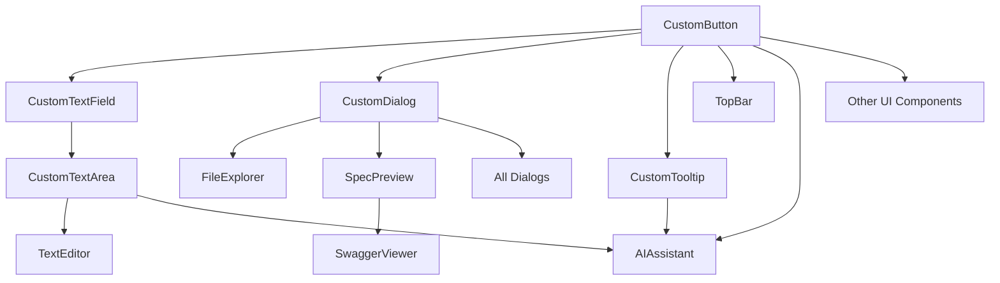

# Component Migration Map: React/TypeScript → Flutter/Dart

## Обзор

Детальная карта миграции компонентов TypeScript проекта во Flutter с приоритетами, зависимостями и пошаговым планом реализации.

## 1. Стратегия миграции

### 1.1 Принципы
- **Снизу-вверх**: сначала базовые UI компоненты
- **Независимость**: мигрировать компоненты независимо
- **Тестирование**: каждый компонент тестировать отдельно
- **Параллельность**: можно мигрировать несколько компонентов одновременно

### 1.2 Фазы миграции
1. **Phase 1**: Базовые UI компоненты (Foundation)
2. **Phase 2**: Компоненты приложения (Core Features)
3. **Phase 3**: Сложные интеграции (Advanced Features)
4. **Phase 4**: Оптимизация и полировка (Refinement)

## 2. Phase 1: Базовые UI компоненты (Foundation)

### 2.1 Критически важные компоненты

#### 1. Button (button.tsx)
```yaml
Компонент: button.tsx
Flutter: CustomButton
Приоритет: Критический
Сложность: Средняя
Зависимости: -
Время: 8-12 часов
Путь: lib/shared/widgets/custom_button.dart

Описание:
- 6 вариантов: default, destructive, outline, secondary, ghost, link
- 4 размера: default, sm, lg, icon
- Поддержка asChild
- Состояние loading

Шаги миграции:
1. Создать enum ButtonVariant и ButtonSize
2. Реализовать CustomButton StatelessWidget
3. Добавить поддержку всех вариантов
4. Добавить состояние загрузки
5. Написать тесты

Тестирование:
- Визуальное соответствие всем вариантам
- Нажатия и состояния
- Адаптивность размеров
```

#### 2. Input (input.tsx)
```yaml
Компонент: input.tsx
Flutter: CustomTextField
Приоритет: Критический
Сложность: Низкая
Зависимости: -
Время: 4-6 часов
Путь: lib/shared/widgets/custom_text_field.dart

Описание:
- Базовое поле ввода
- Поддержка всех HTML input атрибутов
- Валидация
- Фокус стили

Шаги миграции:
1. Создать CustomTextField StatelessWidget
2. Реализовать InputDecoration
3. Добавить валидацию
4. Поддержать все типы input
5. Написать тесты

Тестирование:
- Ввод текста
- Валидация
- Фокус состояния
- Placeholder
```

#### 3. Textarea (textarea.tsx)
```yaml
Компонент: textarea.tsx
Flutter: CustomTextArea
Приоритет: Критический
Сложность: Низкая
Зависимости: CustomTextField
Время: 2-4 часов
Путь: lib/shared/widgets/custom_text_area.dart

Описание:
- Многострочное поле ввода
- Автоматическая высота
- Ресайз

Шаги миграции:
1. Наследовать от CustomTextField
2. Добавить maxLines: null
3. Реализовать автоматическую высоту
4. Написать тесты

Тестирование:
- Многострочный ввод
- Авто-высота
- Скроллинг
```

#### 4. Dialog (dialog.tsx)
```yaml
Компонент: dialog.tsx
Flutter: CustomDialog
Приоритет: Критический
Сложность: Средняя
Зависимости: -
Время: 6-8 часов
Путь: lib/shared/widgets/custom_dialog.dart

Описание:
- Модальные окна
- Композиционная структура
- Анимации
- Overlay

Шаги миграции:
1. Создать базовый класс BaseDialog
2. Реализовать Header, Content, Footer
3. Добавить анимации
4. Поддержать закрытие
5. Написать тесты

Тестирование:
- Открытие/закрытие
- Анимации
- Кнопки действий
- Оверлей
```

#### 5. Tooltip (tooltip.tsx)
```yaml
Компонент: tooltip.tsx
Flutter: CustomTooltip
Приоритет: Высокий
Сложность: Низкая
Зависимости: -
Время: 2-3 часов
Путь: lib/shared/widgets/custom_tooltip.dart

Описание:
- Всплывающие подсказки
- Позиционирование
- Задержка показа

Шаги миграции:
1. Обернуть Flutter Tooltip
2. Добавить кастомные стили
3. Реализовать задержку
4. Написать тесты

Тестирование:
- Показ/скрытие
- Позиционирование
- Задержка
```

### 2.2 Второстепенные UI компоненты

#### 6. Card (card.tsx)
```yaml
Компонент: card.tsx
Flutter: CustomCard
Приоритет: Высокий
Сложность: Низкая
Зависимости: -
Время: 3-4 часов
Путь: lib/shared/widgets/custom_card.dart

Шаги миграции:
1. Создать Card компоненты
2. Реализовать Header, Content, Footer
3. Добавить тени и границы
4. Написать тесты
```

#### 7. Alert (alert.tsx)
```yaml
Компонент: alert.tsx
Flutter: CustomAlert
Приоритет: Высокий
Сложность: Низкая
Зависимости: -
Время: 3-4 часов
Путь: lib/shared/widgets/custom_alert.dart

Шаги миграции:
1. Создать Alert варианты
2. Добавить иконки
3. Реализовать цвета
4. Написать тесты
```

#### 8. Select (select.tsx)
```yaml
Компонент: select.tsx
Flutter: CustomDropdown
Приоритет: Средний
Сложность: Средняя
Зависимости: -
Время: 6-8 часов
Путь: lib/shared/widgets/custom_dropdown.dart

Шаги миграции:
1. Реализовать DropdownButton
2. Добавить поиск
3. Поддержать множественный выбор
4. Написать тесты
```

## 3. Phase 2: Компоненты приложения (Core Features)

### 3.1 Файловая система

#### 9. FileExplorer (FileExplorer.tsx)
```yaml
Компонент: FileExplorer.tsx
Flutter: FileExplorer
Приоритет: Критический
Сложность: Средняя
Зависимости: CustomButton, CustomTooltip
Время: 16-24 часов
Путь: lib/features/file_explorer/file_explorer.dart

Описание:
- Дерево файлов
- Раскрытие/сворачивание
- Иконки типов файлов
- Контекстное меню

Шаги миграции:
1. Создать FileNode модель
2. Реализовать FileTreeItem StatefulWidget
3. Добавить рекурсивный рендеринг
4. Реализовать раскрытие/сворачивание
5. Добавить иконки типов файлов
6. Реализовать контекстное меню
7. Интегрировать с file_picker
8. Написать тесты

Тестирование:
- Раскрытие/сворачивание папок
- Выбор файлов
- Контекстное меню
- Поиск файлов
- Иконки типов
```

#### 10. TextEditor (TextEditor.tsx)
```yaml
Компонент: TextEditor.tsx
Flutter: TextEditor
Приоритет: Критический
Сложность: Средняя
Зависимости: CustomTextArea, CustomButton
Время: 8-12 часов
Путь: lib/features/text_editor/text_editor.dart

Описание:
- Текстовый редактор
- Сохранение файлов
- Поддержка синтаксиса
- Горячие клавиши

Шаги миграции:
1. Создать TextEditor StatefulWidget
2. Реализовать TextField с контроллером
3. Добавить панель инструментов
4. Реализовать сохранение
5. Добавить горячие клавиши
6. Интегрировать с файловой системой
7. Написать тесты

Тестирование:
- Редактирование текста
- Сохранение
- Горячие клавиши
- Панель инструментов
```

### 3.2 Предпросмотр

#### 11. SpecPreview (SpecPreview.tsx)
```yaml
Компонент: SpecPreview.tsx
Flutter: SpecPreview
Приоритет: Высокий
Сложность: Высокая
Зависимости: CustomButton, CustomCard, CustomDialog
Время: 24-36 часов
Путь: lib/features/spec_preview/spec_preview.dart

Описание:
- Предпросмотр спецификаций
- Поддержка Markdown
- Поддержка HTML
- Swagger интеграция
- Вкладки файлов

Шаги миграции:
1. Создать OpenFile модель
2. Реализовать вкладки файлов
3. Добавить Markdown рендеринг
4. Добавить HTML рендеринг
5. Интегрировать Swagger Viewer
6. Реализовать переключение режимов
7. Добавить музыку
8. Написать тесты

Тестирование:
- Переключение вкладок
- Markdown рендеринг
- HTML рендеринг
- Swagger просмотр
- Режим редактирования
```

#### 12. SwaggerViewer (SwaggerViewer.tsx)
```yaml
Компонент: SwaggerViewer.tsx
Flutter: SwaggerViewer
Приоритет: Средний
Сложность: Средняя
Зависимости: webview_flutter
Время: 8-12 часов
Путь: lib/features/swagger_viewer/swagger_viewer.dart

Описание:
- WebView для Swagger UI
- Поддержка JSON/YAML
- Навигация API

Шаги миграции:
1. Добавить webview_flutter зависимость
2. Создать WebView компонент
3. Реализовать загрузку спецификаций
4. Добавить навигацию
5. Написать тесты

Тестирование:
- Загрузка Swagger UI
- Навигация по API
- JSON/YAML поддержка
```

### 3.3 Интерфейс приложения

#### 13. TopBar (TopBar.tsx)
```yaml
Компонент: TopBar.tsx
Flutter: TopBar
Приоритет: Высокий
Сложность: Средняя
Зависимости: CustomButton, CustomTooltip
Время: 8-12 часов
Путь: lib/shared/widgets/top_bar.dart

Описание:
- Верхняя панель
- Меню приложения
- Индикаторы состояния
- Интеграции

Шаги миграции:
1. Создать TopBar StatelessWidget
2. Реализовать меню
3. Добавить индикаторы AI/Atlassian/Music
4. Реализовать горячие клавиши
5. Написать тесты

Тестирование:
- Меню навигации
- Индикаторы состояния
- Горячие клавиши
- Интеграции
```

#### 14. StatusBar (StatusBar.tsx)
```yaml
Компонент: StatusBar.tsx
Flutter: StatusBar
Приоритет: Средний
Сложность: Низкая
Зависимости: -
Время: 4-6 часов
Путь: lib/shared/widgets/status_bar.dart

Описание:
- Статусная панель
- Информация о приложении
- Прогресс операций

Шаги миграции:
1. Создать StatusBar StatelessWidget
2. Реализовать отображение информации
3. Добавить прогресс индикаторы
4. Написать тесты

Тестирование:
- Отображение информации
- Прогресс индикаторы
- Обновление статуса
```

## 4. Phase 3: Сложные интеграции (Advanced Features)

### 4.1 AI ассистент

#### 15. AIAssistant (AIAssistant.tsx)
```yaml
Компонент: AIAssistant.tsx
Flutter: AIAssistant
Приоритет: Высокий
Сложность: Высокая
Зависимости: CustomButton, CustomTextArea, CustomTooltip, Monaco Editor
Время: 40-60 часов
Путь: lib/features/ai_assistant/ai_assistant.dart

Описание:
- AI чат интерфейс
- История чатов
- Monaco Editor интеграция
- Шаблоны
- Файловые ссылки

Шаги миграции:
1. Создать Message, ChatHistory модели
2. Реализовать чат интерфейс
3. Добавить историю чатов
4. Интегрировать Monaco Editor
5. Реализовать шаблоны
6. Добавить файловые ссылки (@)
7. Реализовать предложенные изменения
8. Добавить модели AI
9. Написать тесты

Тестирование:
- Отправка сообщений
- История чатов
- Monaco Editor
- Шаблоны
- Файловые ссылки
- Предложенные изменения
```

### 4.2 Диалоги

#### 16-23. Dialog компоненты
```yaml
Компоненты: dialogs/*.tsx
Flutter: Dialogs
Приоритет: Средний
Сложность: Средняя
Зависимости: CustomDialog
Время: 32-48 часов
Путь: lib/features/dialogs/

Список:
- AboutDialog → AboutDialog
- AddTemplateDialog → AddTemplateDialog
- AddTemplateTypeDialog → AddTemplateTypeDialog
- ErrorDialog → ErrorDialog
- MusicifyDialog → MusicifyDialog
- OnboardingDialog → OnboardingDialog
- SettingsDialog → SettingsDialog
- TemplatesDialog → TemplatesDialog

Шаги миграции:
1. Создать базовый BaseDialog
2. Реализовать каждый диалог
3. Добавить валидацию форм
4. Интегрировать с состоянием
5. Написать тесты
```

## 5. Phase 4: Оптимизация и полировка (Refinement)

### 5.1 Оставшиеся UI компоненты

#### 24-49. Остальные UI компоненты
```yaml
Компоненты: ui/*.tsx (оставшиеся)
Flutter: Various UI components
Приоритет: Низкий
Сложность: Разная
Зависимости: Базовые компоненты
Время: 80-120 часов
Путь: lib/shared/widgets/

Список приоритетов:
1. table.tsx → CustomTable (высокий)
2. tabs.tsx → CustomTabs (высокий)
3. accordion.tsx → Accordion (средний)
4. slider.tsx → CustomSlider (средний)
5. progress.tsx → ProgressBar (средний)
6. Остальные компоненты (низкий)

Шаги миграции:
1. Определить приоритеты
2. Мигрировать по одному
3. Тестировать каждый
4. Оптимизировать производительность
```

### 5.2 Анимации и переходы

```yaml
Компоненты: Анимации
Flutter: Animations
Приоритет: Средний
Сложность: Средняя
Зависимости: Базовые компоненты
Время: 16-24 часа
Путь: lib/shared/animations/

Шаги миграции:
1. Создать базовые анимации
2. Добавить переходы страниц
3. Реализовать микро-анимации
4. Оптимизировать производительность
```

## 6. Зависимости миграции

### 6.1 Граф зависимостей



### 6.2 Порядок миграции

```yaml
Wave 1 (Foundation):
- CustomButton
- CustomTextField
- CustomTextArea
- CustomDialog
- CustomTooltip

Wave 2 (Core UI):
- CustomCard
- CustomAlert
- CustomDropdown
- CustomTabs

Wave 3 (App Components):
- FileExplorer
- TextEditor
- TopBar
- StatusBar

Wave 4 (Advanced):
- SpecPreview
- SwaggerViewer
- AIAssistant

Wave 5 (Dialogs):
- All dialog components

Wave 6 (Remaining):
- Other UI components
- Animations
- Optimizations
```

## 7. Тестирование стратегии

### 7.1 Уровни тестирования

```yaml
Unit тесты:
- Каждый виджет в изоляции
- Модели данных
- Бизнес-логика

Integration тесты:
- Взаимодействие виджетов
- Потоки данных
- Состояние приложения

UI тесты:
- Пользовательские сценарии
- Визуальное соответствие
- Производительность

Manual тесты:
- Пользовательский опыт
- Кросс-платформенность
- Удобство использования
```

### 7.2 Чек-листы тестирования

#### CustomButton
- [ ] Все варианты отображаются корректно
- [ ] Размеры соответствуют дизайну
- [ ] Нажатия работают
- [ ] Состояние disabled
- [ ] Состояние loading
- [ ] Адаптивность

#### FileExplorer
- [ ] Дерево файлов отображается
- [ ] Раскрытие/сворачивание работает
- [ ] Иконки типов файлов правильные
- [ ] Контекстное меню работает
- [ ] Поиск файлов работает
- [ ] Производительность с большими деревьями

#### AIAssistant
- [ ] Отправка сообщений работает
- [ ] История чатов сохраняется
- [ ] Monaco Editor загружается
- [ ] Шаблоны работают
- [ ] Файловые ссылки работают
- [ ] Предложенные изменения отображаются
- [ ] Переключение моделей работает

## 8. Риски и митигация

### 8.1 Технические риски

```yaml
Риск: Monaco Editor интеграция
Влияние: Высокое
Митигация: Использовать monaco_editor пакет, fallback на TextField

Риск: Производительность больших деревьев файлов
Влияние: Среднее
Митигация: Ленивая загрузка, виртуализация

Риск: WebView производительность
Влияние: Среднее
Митигация: Кэширование, оптимизация контента

Риск: Сложность состояния AIAssistant
Влияние: Высокое
Митигация: Разделение состояния, Provider паттерн
```

### 8.2 Проектные риски

```yaml
Риск: Визуальное несоответствие
Влияние: Среднее
Митигация: Регулярное сравнение с дизайном

Риск: Проблемы с производительностью
Влияние: Среднее
Митигация: Профилирование, оптимизация

Риск: Сложность тестирования
Влияние: Низкое
Митигация: TDD подход, мокирование
```

## 9. Ресурсы и время

### 9.1 Команда

```yaml
Flutter Developer (Senior):
- Архитектура
- Сложные компоненты
- Code review

Flutter Developer (Middle):
- UI компоненты
- Тестирование
- Документация

UI/UX Designer:
- Дизайн система
- Визуальное соответствие
- Пользовательский опыт

QA Engineer:
- Тестирование
- Автоматизация
- Баг-трекинг
```

### 9.2 Инфраструктура

```yaml
Инструменты:
- Flutter SDK
- VS Code / IntelliJ
- Git
- Jira / Linear

Зависимости:
- provider
- monaco_editor
- webview_flutter
- file_picker
- flutter_svg
- flutter_markdown
- flutter_html

Тестирование:
- flutter_test
- integration_test
- golden_tests
```

### 9.3 Оценка времени

```yaml
Phase 1 (Foundation): 40-60 часов
Phase 2 (Core Features): 80-120 часов
Phase 3 (Advanced): 80-100 часов
Phase 4 (Refinement): 100-140 часов

Итого: 300-420 часов (37-52 рабочих дней)

При 2 разработчиках: 19-26 рабочих дней
При 3 разработчиках: 13-17 рабочих дней
```

## 10. Успех критерии

### 10.1 Функциональные критерии

```yaml
Must have:
- Все основные компоненты мигрированы
- Визуальное соответствие дизайну
- Базовая функциональность работает
- Производительность приемлема

Should have:
- Все UI компоненты мигрированы
- Продвинутая функциональность
- Анимации и переходы
- Полное тестовое покрытие

Could have:
- Оптимизации производительности
- Дополнительные фичи
- Улучшенный UX
- Расширенная документация
```

### 10.2 Качественные критерии

```yaml
Код:
- Чистая архитектура
- Следование Flutter конвенциям
- Хорошая документация
- Высокое тестовое покрытие

Производительность:
- Быстрая загрузка
- Плавные анимации
- Эффективное использование памяти
- Адаптивность

UX:
- Интуитивный интерфейс
- Доступность
- Консистентность
- Отзывчивость
```

Эта карта миграции обеспечивает структурированный подход к переносу TypeScript компонентов во Flutter с минимальными рисками и предсказуемыми результатами.