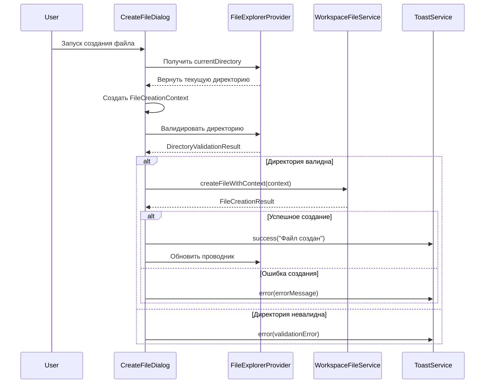
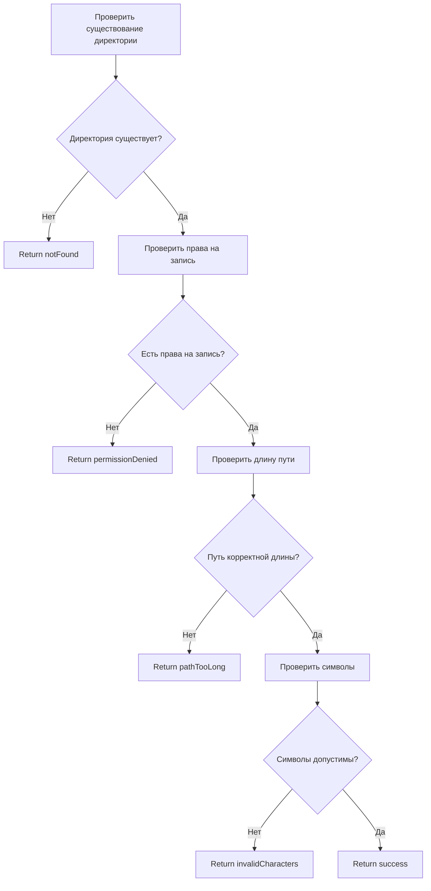

# File Creation API Contract

**Feature**: Исправление пути создания файлов  
**Date**: 31.10.2025  
**Version**: 1.0  

## Overview

Этот контракт определяет API для создания файлов в правильной директории проекта с использованием текущего контекста проводника файлов.

## Core Services

### FileExplorerProvider API

```dart
abstract class IFileExplorerProvider {
  /// Текущая директория в проводнике файлов
  String get currentDirectory;
  
  /// Установить текущую директорию
  void setCurrentDirectory(String path);
  
  /// Валидировать директорию для создания файла
  Future<DirectoryValidationResult> validateDirectory(String path);
  
  /// Проверить доступность директории
  Future<bool> isDirectoryAccessible(String path);
}
```

### WorkspaceFileService API

```dart
abstract class IWorkspaceFileService {
  /// Создать файл с контекстом (новый метод)
  Future<FileCreationResult> createFileWithContext(
    FileCreationContext context
  );
  
  /// Создать файл (существующий метод для обратной совместимости)
  Future<void> createFile(String path, String content);
  
  /// Проверить существование файла
  Future<bool> fileExists(String path);
  
  /// Получить тип файла
  FileType getFileType(String fileName);
}
```

### ToastService API

```dart
abstract class IToastService {
  /// Показать успешное уведомление
  static void success(String description);
  
  /// Показать ошибку
  static void error(String description);
  
  /// Показать предупреждение
  static void warning(String description);
  
  /// Показать информационное сообщение
  static void info(String description);
}
```

## Data Models

### FileCreationContext

```dart
class FileCreationContext {
  final String fileName;
  final String currentDirectory;
  final String projectRoot;
  final String fullPath;
  final DateTime timestamp;
  
  const FileCreationContext({
    required this.fileName,
    required this.currentDirectory,
    required this.projectRoot,
    required this.fullPath,
    required this.timestamp,
  });
  
  // Factory constructor для создания из параметров
  factory FileCreationContext.create({
    required String fileName,
    required String currentDirectory,
    required String projectRoot,
  }) {
    final fullPath = _buildFullPath(currentDirectory, fileName);
    return FileCreationContext(
      fileName: fileName,
      currentDirectory: currentDirectory,
      projectRoot: projectRoot,
      fullPath: fullPath,
      timestamp: DateTime.now(),
    );
  }
  
  // Валидация
  bool get isValid => _validatePath();
  String? get validationError => _getValidationError();
}
```

### DirectoryValidationResult

```dart
class DirectoryValidationResult {
  final bool isAccessible;
  final bool hasWritePermission;
  final String? errorMessage;
  final DirectoryValidationStatus status;
  
  const DirectoryValidationResult({
    required this.isAccessible,
    required this.hasWritePermission,
    this.errorMessage,
    required this.status,
  });
  
  // Factory constructors
  factory DirectoryValidationResult.success() {
    return const DirectoryValidationResult(
      isAccessible: true,
      hasWritePermission: true,
      status: DirectoryValidationStatus.accessible,
    );
  }
  
  factory DirectoryValidationResult.notFound(String path) {
    return DirectoryValidationResult(
      isAccessible: false,
      hasWritePermission: false,
      errorMessage: 'Directory not found: $path',
      status: DirectoryValidationStatus.notFound,
    );
  }
  
  factory DirectoryValidationResult.permissionDenied(String path) {
    return DirectoryValidationResult(
      isAccessible: true,
      hasWritePermission: false,
      errorMessage: 'Permission denied: $path',
      status: DirectoryValidationStatus.permissionDenied,
    );
  }
}
```

### FileCreationResult

```dart
class FileCreationResult {
  final bool success;
  final String? filePath;
  final String? errorMessage;
  final FileCreationErrorType? errorType;
  
  const FileCreationResult({
    required this.success,
    this.filePath,
    this.errorMessage,
    this.errorType,
  });
  
  // Factory constructors
  factory FileCreationResult.success(String filePath) {
    return FileCreationResult(
      success: true,
      filePath: filePath,
    );
  }
  
  factory FileCreationResult.error(
    FileCreationErrorType errorType,
    String errorMessage,
  ) {
    return FileCreationResult(
      success: false,
      errorType: errorType,
      errorMessage: errorMessage,
    );
  }
}
```

## Enums

### DirectoryValidationStatus

```dart
enum DirectoryValidationStatus {
  accessible,      // Директория доступна
  notFound,        // Директория не найдена
  permissionDenied, // Нет прав на запись
  pathTooLong,     // Путь слишком длинный
  invalidCharacters // Недопустимые символы
}
```

### FileCreationErrorType

```dart
enum FileCreationErrorType {
  none,                // Нет ошибки
  directoryNotFound,   // Директория не найдена
  permissionDenied,    // Нет прав на запись
  fileAlreadyExists,   // Файл уже существует
  invalidFileName,     // Недопустимое имя файла
  diskFull,           // Нет места на диске
  unknownError        // Неизвестная ошибка
}
```

## Integration Flow

### 1. File Creation Flow



### 2. Directory Validation Flow



## Error Handling

### Error Response Format

```dart
class FileCreationError {
  final FileCreationErrorType type;
  final String message;
  final String? details;
  final DateTime timestamp;
  
  const FileCreationError({
    required this.type,
    required this.message,
    this.details,
    required this.timestamp,
  });
  
  Map<String, dynamic> toJson() {
    return {
      'type': type.name,
      'message': message,
      'details': details,
      'timestamp': timestamp.toIso8601String(),
    };
  }
}
```

### Error Codes Mapping

| Error Type | HTTP Code | User Message | Technical Details |
|------------|-----------|--------------|------------------|
| directoryNotFound | 404 | Директория не найдена | Directory does not exist |
| permissionDenied | 403 | Нет прав на запись | Write permission denied |
| fileAlreadyExists | 409 | Файл уже существует | File already exists |
| invalidFileName | 400 | Недопустимое имя файла | Invalid file name format |
| diskFull | 507 | Нет места на диске | Insufficient disk space |
| unknownError | 500 | Внутренняя ошибка | Internal server error |

## Localization Support

### Message Keys

```dart
// AppLocalizations keys для локализации
class FileCreationLocalizationKeys {
  static const String fileCreated = 'fileCreated';
  static const String fileCreationError = 'fileCreationError';
  static const String invalidFileName = 'invalidFileName';
  static const String permissionDenied = 'permissionDenied';
  static const String directoryNotFound = 'directoryNotFound';
  static const String fileAlreadyExists = 'fileAlreadyExists';
  static const String diskFull = 'diskFull';
}
```

### Usage Examples

```dart
// Пример локализованного сообщения
final message = AppLocalizations.of(context)!.fileCreationError(
  context.fileName,
  errorType.toString(),
);

// Пример успешного сообщения
final successMessage = AppLocalizations.of(context)!.fileCreated(
  context.fileName,
);
```

## Performance Requirements

### Response Times
- Directory validation: < 100ms
- File creation: < 2s
- UI updates: < 50ms

### Caching Strategy
- Directory validation results: 5 minutes TTL
- File existence checks: 1 minute TTL
- Permission checks: 10 minutes TTL

## Security Requirements

### Path Validation
- Prevent path traversal attacks
- Validate file name length (max 255 chars)
- Sanitize special characters
- Check for reserved names

### Permission Checks
- Verify write permissions before creation
- Validate directory accessibility
- Check disk space availability

## Testing Requirements

### Unit Tests Coverage
- All validation methods: 100%
- Error handling: 100%
- Edge cases: 100%

### Integration Tests
- End-to-end file creation flow
- Error scenarios handling
- Performance benchmarks

### Manual Testing Scenarios
- Create file in root directory
- Create file in nested directory (3+ levels)
- Create file with invalid name
- Create file in read-only directory
- Create file when directory doesn't exist